# Credit, Coinage and Clear

David Graeber's *Debt: The First 5,000 Years* is useful for Clear because it
breaks the simple story that money evolved in one straight line from barter to
coins to banks to digital payments. The more interesting pattern is an
oscillation between credit systems and coinage systems.

That oscillation is the starting point for understanding Clear.

Credit systems work through records, relationships, account units, and trust.
Coinage systems work through portable bearer objects that can circulate even
when the parties do not know or trust one another very much. History moves back
and forth between those models, and often combines them.

Clear sits inside that oscillation rather than outside it. It is neither
ordinary credit nor ordinary coin. It is a private bearer instrument issued
against an explicit treasury promise. It carries some of the portability and
finality people associate with coinage, while preserving the issuer-specific
obligation and recognition that make credit systems work.

That middle position is exactly the opportunity.

<figure markdown>

<figcaption>Clear sits inside the historical oscillation between credit and coinage: credit in meaning, coin-like in circulation, cryptographic in form.</figcaption>
</figure>

## The oscillation

Graeber argues that large parts of Eurasian monetary history move between two
broad modes.

In periods of relative stability, social trust, religious authority, merchant
networks, or strong local institutions, credit systems can dominate. People
record obligations, clear accounts, extend trust, and use a unit of account
without needing metal to change hands in every transaction. Mesopotamian debt
records, medieval merchant credit, tally systems, and account money all fit
different versions of this pattern.

In periods of war, plunder, mobility, and social rupture, bullion and coinage
become more useful. A soldier, raider, tax collector, or stranger may not be a
good credit risk. A coin or lump of metal can be accepted without knowing much
about the person presenting it, provided the receiver trusts the metal, weight,
mark, or likelihood that someone else will accept it.

Graeber's contrast is not that credit is peaceful and coinage is evil. It is
that different trust environments favor different instruments.

```text
stable trust networks -> credit, ledgers, account money
generalized violence  -> bullion, coinage, portable bearer value
```

Clear should be understood against that background.

## Coinage created markets

One of Graeber's strongest claims is that coinage did not simply arise because
people in barter markets needed a more convenient medium. He emphasizes the
role of states, armies, mines, taxation, and provisioning.

A ruler with soldiers has a practical problem. Feeding and supplying an army by
direct requisition is difficult. But if the ruler pays soldiers in coin and
then requires the population to pay taxes in that same coin, people must obtain
the coin. The easiest way to do that is to sell goods and services to soldiers,
officials, suppliers, or others already receiving it. A market forms around the
state's fiscal and military loop.

```text
state mints coin
  -> state pays soldiers or officials
  -> people need coin for taxes, fees, or fines
  -> people supply goods and services to obtain coin
  -> coin returns to the treasury
```

This is close to modern state-money and monetary-sovereignty arguments:
taxation does not merely collect money that already existed in private markets.
It can help create demand for the unit in the first place.

For Clear, the parallel is not that every issuer is a state or that every CMU
is money. The parallel is the loop. A unit becomes useful when an issuer pays,
allocates, or distributes it, and then recognized parties accept it back under
policy.

## Coinage and credit were never opposites

The oscillation between credit and coinage does not mean that one mode
abolishes the other.

Graeber notes that credit systems can use monetary units long after the
physical coins disappear. Medieval accounts could continue to use inherited
money-of-account systems even when the actual coins were gone, debased,
variable, or only loosely related to the accounting unit. A unit of account can
survive as a way to measure obligations even when the bearer object is scarce
or absent.

The reverse is also true. Coinage can coexist with credit. A coin may circulate
as bearer value, while loans, taxes, wages, rents, temple accounts, merchant
bills, and public debts are recorded around it. Even in highly monetized
periods, much economic life remains relational and ledger-based.

That is the key lesson for Clear: coinage and credit are not mutually
exclusive. They are different ways of arranging trust, account, authority, and
transfer.

## Clear between credit and coin

Clear occupies a strange and useful middle ground.

It is credit-like because each CMU is an issuer-defined obligation. A food
credit, compute credit, refund credit, service unit, state-recognized voucher,
or member benefit is meaningful only because some issuer or recognized network
stands behind it. The holder needs to know who issued it, what policy governs
it, where it is accepted, and what redemption accomplishes.

It is coin-like because each Mint Note is a bearer instrument. A holder can
carry it locally, transfer it directly, and present it without maintaining a
named balance at the mint. The note is not merely a line in a central account
database. It is a spendable proof for one exact CMU.

Clear is therefore:

```text
credit-backed like an issuer obligation
coin-like as a transferable bearer instrument
cryptographic rather than metallic
redeemable under policy rather than universally legal tender
```

That is different from both ordinary account credit and ordinary coinage.

## Not a payment rail

This framing also clarifies why blockchains and stablecoins are often the wrong
comparison.

A payment rail moves an already-defined unit. A stablecoin normally represents
a claim on money, reserves, or another off-system asset. A blockchain records
ownership or transfer according to its own ledger rules. In all of these cases,
the rail operator or ledger may become an extra party that users must trust
even when the real economic trust is somewhere else.

Clear is meant to align the technical trust boundary with the institutional
trust boundary. The relevant endpoint of trust is the issuer's treasury: the
community, company, program, delegated authority, compute provider, or public
institution that defines and redeems the unit.

```text
payment rail model:
holder -> rail or ledger operator -> asset issuer or reserve promise

Clear model:
holder -> issuer-recognized mint and treasury policy
```

The mint still matters. It signs, validates, prevents double spending, and
preserves supply evidence. But it is not supposed to become an unrelated
universal intermediary. Its job is to express the issuer's own authority and
redemption policy in bearer form.

## Treasury-backed bearer ecash

Clear can be described as treasury-backed bearer ecash, provided that phrase is
understood carefully.

"Treasury-backed" does not always mean backed by cash, government money, or a
financial reserve. It means the unit is backed by the issuer's published
treasury policy: the goods, services, benefits, compute, reimbursement,
recognition, or settlement action the issuer promises when Mint Notes return.

"Bearer ecash" means the holder controls transferable Mint Notes rather than a
named account balance. Cashu-style blind signatures help unlink issuance from
redemption better than ordinary account ledgers, while the mint's spent-proof
state prevents the same note from being redeemed twice.

Together, those two properties make Clear unusual:

- more portable than a private account credit;
- more issuer-specific than general-purpose cash;
- more direct than routing value through an unrelated payment rail;
- more policy-aware than a generic token; and
- more plural than a single national or stablecoin balance.

## Why this matters now

Clear's initial audience may be communities and corporations that want to issue
their own circulating units. That remains the most immediate use.

But the same architecture can also attract state-adjacent programs and compute
markets because both need bounded issuance without turning every interaction
into a full payment flow.

A public-purpose program may want a redeemable benefit unit that circulates
only among eligible people and recognized providers. A compute provider may
want to fund agents with a finite allowance for inference, storage, retrieval,
or tool use. A community may want a local service credit. A corporation may want
a benefit, refund, or internal allocation unit. These are different legal and
economic instruments, but each has the same minting shape:

```text
issuer defines a unit
  -> treasury authorizes supply
  -> bearer notes circulate
  -> recognized endpoints accept them
  -> redemption or retirement settles the obligation
```

That is why Clear sits in the middle of the credit/coinage oscillation. It is a
credit instrument that can move like coin. It is a coin-like instrument whose
meaning remains credit-like: attached to an issuer, a treasury, and a policy.

## The robust middle

Graeber's history suggests that monetary systems are resilient when they match
their trust environment.

Pure account credit works well where identity, continuity, law, or community
trust are strong. Metal coinage works well where portable acceptance matters
more than personal trust. Payment rails work well where the unit already exists
and the main problem is routing.

Clear is for a different problem: a community or institution has a real
treasury promise, wants people or agents to hold and transfer it privately, and
does not want an unrelated rail operator to become the main locus of trust.

In that setting, the robust instrument may be neither credit nor coin in the
old sense.

It may be a treasury-issued bearer note:

```text
credit in meaning
coin-like in circulation
cryptographic in form
redeemable by policy
plural by design
```

That is Clear's opening.

## Sources

- David Graeber, *Debt: The First 5,000 Years*, Melville House, 2011.
- G. F. Knapp, *The State Theory of Money*, 1905.
- A. Mitchell-Innes, "What is Money?", *The Banking Law Journal*, 1913.
